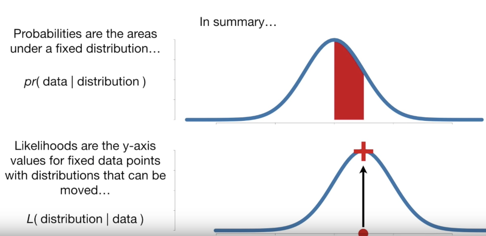

- [1. Why do you use feature selection?](#1-why-do-you-use-feature-selection)
    - [Filter Methods](#filter-methods)
    - [Embedded Methods](#embedded-methods)
    - [Misleading](#misleading)
    - [Overfitting](#overfitting)
- [2. Explain what regularization is and why it is useful.](#2-explain-what-regularization-is-and-why-it-is-useful)
- [3. What’s the difference between L1 and L2 regularization?](#3-whats-the-difference-between-l1-and-l2-regularization)
- [4. How would you validate a model you created to generate a predictive model of a quantitative outcome variable using multiple regression?](#4-how-would-you-validate-a-model-you-created-to-generate-a-predictive-model-of-a-quantitative-outcome-variable-using-multiple-regression)
- [5. Explain what precision and recall are. How do they relate to the ROC curve?](#5-explain-what-precision-and-recall-are-how-do-they-relate-to-the-roc-curve)
- [6. Is it better to have too many false positives, or too many false negatives?](#6-is-it-better-to-have-too-many-false-positives--or-too-many-false-negatives)
- [7. How do you deal with unbalanced binary classification?](#7-how-do-you-deal-with-unbalanced-binary-classification)
- [8. What is statistical power?](#8-what-is-statistical-power)
- [9. What are bias and variance, and what are their relation to modeling data?](#9-what-are-bias-and-variance--and-what-are-their-relation-to-modeling-data)
    - [Approaches](#approaches)
- [10. How to deal with missing data?](#10-How-to-deal-with-missing-data)
- [11. Outliers and leverage and influential points in Regresssion context](#11-Outliers-and-leverage-and-influential-points-in-Regresssion-context)
- [12. What are some ways I can make my model more robust to outliers?](#12-what-are-some-ways-i-can-make-my-model-more-robust-to-outliers)
- [13. In unsupervised learning, how can we determine the most useful number of clusters to be?](#13-In-unsupervised-learning-how-can-we-determine-the-most-useful-number-of-clusters-to-be)
- [14. Central limit theorem](#14-Central-limit-theorem)
- [15. Describe the differences between and use cases for box plots and histograms](#15-describe-the-differences-between-and-use-cases-for-box-plots-and-histograms)
- [16. How would you find an anomaly in a distribution?](#16-how-would-you-find-an-anomaly-in-a-distribution)
    - [Statistical methods](#statistical-methods)
    - [Clustering-based anomaly detection](#Clustering-based-anomaly-detection)
- [17. How do you deal with outliers in your data?](#17-how-do-you-deal-with-outliers-in-your-data)
- [18. How do you deal with sparse data?](#18-how-do-you-deal-with-sparse-data)
- [19. Big Data Engineer Can you explain what REST is?](#19-big-data-engineer-can-you-explain-what-rest-is)
- [20. Logistic regression](#20-logistic-regression)
- [21. What is the effect on the coefficients of logistic regression if two predictors are highly correlated? What are the confidence intervals of the coefficients?](#21-what-is-the-effect-on-the-coefficients-of-logistic-regression-if-two-predictors-are-highly-correlated-what-are-the-confidence-intervals-of-the-coefficients)
- [22. What’s the difference between Gaussian Mixture Model and K-Means?](#22-whats-the-difference-between-gaussian-mixture-model-and-k-means)
- [23. Describe how Gradient Boosting works](#23-describe-how-gradient-boosting-works)
  - [AdaBoost the First Boosting Algorithm](#adaboost-the-first-boosting-algorithm)
    - [Loss Function](#loss-function)
    - [Weak Learner](#weak-learner)
    - [Additive Model](#additive-model)
  - [Improvements to Basic Gradient Boosting](#improvements-to-basic-gradient-boosting)
    - [Tree Constraints](#tree-constraints)
    - [Weighted Updates](#weighted-updates)
    - [Stochastic Gradient Boosting](#stochastic-gradient-boosting)
    - [Penalized Gradient Boosting](#penalized-gradient-boosting)
- [24. Difference between Adaboost and GB and XGBoost](#24-Difference-between-Adaboost-and-GB-and-XGBoost)
- [25. How does a DT split](#25-How-does-a-DT-split)
- [26. Notes from Coursera Deep Learning courses by Andrew Ng](#26-notes-from-coursera-deep-learning-courses-by-andrew-ng)
- [27. Likelihood VS Probability](#27-Likelihood-VS-Probability)
- [28. When to stop training the model](#28-When-to-stop-training-the-model)

## 1. Why do you use feature selection?
Feature selection is the process of selecting a subset of relevant features for use in model construction. Feature selection is itself useful, but it mostly acts as a filter, muting out features that aren’t useful in addition to your existing features.
Feature selection methods aid you in your mission to create an accurate predictive model. They help you by choosing features that will give you as good or better accuracy whilst requiring less data.
Feature selection methods can be used to identify and remove unneeded, irrelevant and redundant attributes from data that do not contribute to the accuracy of a predictive model or may in fact decrease the accuracy of the model.
Fewer attributes is desirable because it reduces the complexity of the model, and a simpler model is simpler to understand and explain.
#### Filter Methods
Filter feature selection methods apply a statistical measure to assign a scoring to each feature. The features are ranked by the score and either selected to be kept or removed from the dataset. The methods are often univariate and consider the feature independently, or with regard to the dependent variable.
Some examples of some filter methods include the Chi squared test, information gain and correlation coefficient scores.
#### Embedded Methods
Embedded methods learn which features best contribute to the accuracy of the model while the model is being created. The most common type of embedded feature selection methods are regularization methods.
Regularization methods are also called penalization methods that introduce additional constraints into the optimization of a predictive algorithm (such as a regression algorithm) that bias the model toward lower complexity (fewer coefficients).
Examples of regularization algorithms are the LASSO, Elastic Net and Ridge Regression.
#### Misleading
Including redundant attributes can be misleading to modeling algorithms. Instance-based methods such as k-nearest neighbor use small neighborhoods in the attribute space to determine classification and regression predictions. These predictions can be greatly skewed by redundant attributes.
#### Overfitting
Keeping irrelevant attributes in your dataset can result in overfitting. Decision tree algorithms like C4.5 seek to make optimal spits in attribute values. Those attributes that are more correlated with the prediction are split on first. Deeper in the tree less relevant and irrelevant attributes are used to make prediction decisions that may only be beneficial by chance in the training dataset. This overfitting of the training data can negatively affect the modeling power of the method and cripple the predictive accuracy.

## 2. Explain what regularization is and why it is useful.
Regularization is the process of adding a tuning parameter to a model to induce smoothness in order to prevent [overfitting](https://en.wikipedia.org/wiki/Overfitting).

This is most often done by adding a constant multiple to an existing weight vector. This constant is often either the [L1 (Lasso)](https://en.wikipedia.org/wiki/Lasso_(statistics)) or [L2 (ridge)](https://en.wikipedia.org/wiki/Tikhonov_regularization), but can in actuality can be any norm. The model predictions should then minimize the mean of the loss function calculated on the regularized training set.

It is well known, as explained by others, that L1 regularization helps perform feature selection in sparse feature spaces, and that is a good practical reason to use L1 in some situations. However, beyond that particular reason I have never seen L1 to perform better than L2 in practice. If you take a look at [LIBLINEAR FAQ](https://www.csie.ntu.edu.tw/~cjlin/liblinear/FAQ.html#l1_regularized_classification) on this issue you will see how they have not seen a practical example where L1 beats L2 and encourage users of the library to contact them if they find one. Even in a situation where you might benefit from L1's sparsity in order to do feature selection, using L2 on the remaining variables is likely to give better results than L1 by itself.

## 3. What’s the difference between L1 and L2 regularization?
Regularization is a very important technique in machine learning to prevent overfitting. Mathematically speaking, it adds a regularization term in order to prevent the coefficients to fit so perfectly to overfit. The difference between the L1(Lasso) and L2(Ridge) is just that L2(Ridge) is the sum of the square of the weights, while L1(Lasso) is just the sum of the absolute weights in MSE or another loss function. As follows:

The difference between their properties can be promptly summarized as follows:

**Solution uniqueness** is a simpler case but requires a bit of imagination. First, this picture below:

## 4. How would you validate a model you created to generate a predictive model of a quantitative outcome variable using multiple regression?
[Proposed methods](http://support.sas.com/resources/papers/proceedings12/333-2012.pdf) for model validation:
* If the values predicted by the model are far outside of the response variable range, this would immediately indicate poor estimation or model inaccuracy.
* If the values seem to be reasonable, examine the parameters; any of the following would indicate poor estimation or multi-collinearity: opposite signs of expectations, unusually large or small values, or observed inconsistency when the model is fed new data.
* Use the model for prediction by feeding it new data, and use the [coefficient of determination](https://en.wikipedia.org/wiki/Coefficient_of_determination) (R squared) as a model validity measure.
* Use data splitting to form a separate dataset for estimating model parameters, and another for validating predictions.
* Use [jackknife resampling](https://en.wikipedia.org/wiki/Jackknife_resampling) if the dataset contains a small number of instances, and measure validity with R squared and [mean squared error](https://en.wikipedia.org/wiki/Mean_squared_error) (MSE).

## 5. Explain what precision and recall are. How do they relate to the ROC curve?
Calculating precision and recall is actually quite easy. Imagine there are 100 positive cases among 10,000 cases. You want to predict which ones are positive, and you pick 200 to have a better chance of catching many of the 100 positive cases. You record the IDs of your predictions, and when you get the actual results you sum up how many times you were right or wrong. There are four ways of being right or wrong:
1. TN / True Negative: case was negative and predicted negative
2. TP / True Positive: case was positive and predicted positive
3. FN / False Negative: case was positive but predicted negative
4. FP / False Positive: case was negative but predicted positive

Now, your boss asks you three questions:
* What percent of your predictions were correct?
You answer: the "accuracy" was (9,760+60) out of 10,000 = 98.2%
* What percent of the positive cases did you catch?
You answer: the "recall" was 60 out of 100 = 60%
* What percent of positive predictions were correct?
You answer: the "precision" was 60 out of 200 = 30%
See also a very good explanation of [Precision and recall](https://en.wikipedia.org/wiki/Precision_and_recall) in Wikipedia.

ROC curve represents a relation between TPR (True positive rate, aka Sensitivity)/ TNR (True negative rate, aka Specificity) and is commonly used to measure the performance of binary classifiers. However, when dealing with highly skewed datasets, [Precision-Recall (PR)](http://pages.cs.wisc.edu/~jdavis/davisgoadrichcamera2.pdf) curves give a more representative picture of performance.

* Sensitivity is calculated as,
`Sensitivity = TP / (TP + FN)`. Since the formula doesn’t contain FP and TN, Sensitivity may give you a biased result, especially for imbalanced classes.
In the example of Fraud detection, it gives you the percentage of Correctly Predicted Frauds from the pool of Actual Frauds pool of Actual Non-Frauds.
* Specificity, is calculated as, 
`Specificity = TN / (TN + FP)`. Since the formula does not contain FN and TP, Specificity may give you a biased result, especially for imbalanced classes.
In the example of Fraud detection, it gives you the percentage of Correctly Predicted Non-Frauds from the pool of Actual Frauds pool of Actual Non-Frauds

ROC curve is independent from threshold and irrelavent to class-size. When threshold changes from 1 to 0, it moves along the ROC curve from left-bottom to right-top. Since we need a number to compare between different ROC, we use AUC to do it.

* AUC is equal to the probability that the classifier will rank a randomly chosen positive example higher than a randomly chosen negative example

[Assessing and Comparing Classifier Performance with ROC Curves](https://machinelearningmastery.com/assessing-comparing-classifier-performance-roc-curves-2/)

## 6. Is it better to have too many false positives, or too many false negatives?
It depends on the question as well as on the domain for which we are trying to solve the question.

In medical testing, false negatives may provide a falsely reassuring message to patients and physicians that disease is absent, when it is actually present. This sometimes leads to inappropriate or inadequate treatment. So, it is desired to have too many false positive.

For spam filtering, a false positive occurs when spam filtering or spam blocking techniques wrongly classify a legitimate email message as spam. While most anti-spam tactics can block or filter a high percentage of unwanted emails, doing so without creating significant false-positive results is a much more demanding task. So, we prefer too many false negatives over many false positives.

## 7. How do you deal with unbalanced binary classification?
Imbalanced data typically refers to a problem with classification problems where the classes are not represented equally.

The remaining discussions will assume a two-class classification problem because it is easier to think about and describe.
1. Can You Collect More Data? 
A larger dataset might expose a different and perhaps more balanced perspective on the classes.
More examples of minor classes may be useful later when we look at resampling your dataset.
2. Try Changing Your Performance Metric 
Accuracy is not the metric to use when working with an imbalanced dataset. We have seen that it is misleading.
From that post, I recommend looking at the following performance measures that can give more insight into the accuracy of the model than traditional classification accuracy:
  - [Confusion Matrix](https://en.wikipedia.org/wiki/Confusion_matrix): A breakdown of predictions into a table showing correct predictions (the diagonal) and the types of incorrect predictions made (what classes incorrect predictions were assigned).
  - [Precision](https://en.wikipedia.org/wiki/Information_retrieval#Precision): A measure of a classifiers exactness. Precision is the number of True Positives divided by the number of True Positives and False Positives. Put another way, it is the number of positive predictions divided by the total number of positive class values predicted. It is also called the [Positive Predictive Value (PPV)](https://en.wikipedia.org/wiki/Positive_and_negative_predictive_values). Precision can be thought of as a measure of a classifiers exactness. A low precision can also indicate a large number of False Positives.
  - [Recall](https://en.wikipedia.org/wiki/Information_retrieval#Recall): A measure of a classifiers completeness. Recall is the number of True Positives divided by the number of True Positives and the number of False Negatives. Put another way it is the number of positive predictions divided by the number of positive class values in the test data. It is also called Sensitivity or the True Positive Rate. Recall can be thought of as a measure of a classifiers completeness. A low recall indicates many False Negatives.
  - [F1 Score (or F-score)](https://en.wikipedia.org/wiki/F1_score): A weighted average of precision and recall.
I would also advise you to take a look at the following:
  - Kappa (or [Cohen’s kappa](https://en.wikipedia.org/wiki/Cohen%27s_kappa)): Classification accuracy normalized by the imbalance of the classes in the data.
  - ROC Curves: Like precision and recall, accuracy is divided into sensitivity and specificity and models can be chosen based on the balance thresholds of these values.
3. Try Resampling Your Dataset, like using SMOTE 
  * You can add copies of instances from the under-represented class called over-sampling (or more formally sampling with replacement)
  * You can delete instances from the over-represented class, called under-sampling.
4. Try Different Algorithms, like SVM, tree-based models 
5. Try Penalized Models 
You can use the same algorithms but give them a different perspective on the problem.
Penalized classification imposes an additional cost on the model for making classification mistakes on the minority class during training. These penalties can bias the model to pay more attention to the minority class.
Often the handling of class penalties or weights are specialized to the learning algorithm. There are penalized versions of algorithms such as penalized-SVM and penalized-LDA.
Using penalization is desirable if you are locked into a specific algorithm and are unable to resample or you’re getting poor results. It provides yet another way to “balance” the classes. Setting up the penalty matrix can be complex. You will very likely have to try a variety of penalty schemes and see what works best for your problem.
6. Try a Different Perspective, like anomaly detection and change detection 

## 8. What is statistical power?
[Statistical power or sensitivity](https://en.wikipedia.org/wiki/Statistical_power) of a binary hypothesis test is the probability that the test correctly rejects the null hypothesis (H0) when the alternative hypothesis (H1) is true.

To put in another way, [Statistical power](https://effectsizefaq.com/2010/05/31/what-is-statistical-power/) is the likelihood that a study will detect an effect when the effect is present. The higher the statistical power, the less likely you are to make a Type II error (concluding there is no effect when, in fact, there is).

Review: power-calculation for A/B testing.

## 9. What are bias and variance, and what are their relation to modeling data?
**Bias** is how far removed a model's predictions are from correctness.

**Variance** is the degree to which these predictions vary between model iterations.

[Decomposition of bias and variance is here](https://en.wikipedia.org/wiki/Bias–variance_tradeoff)

**Error due to Bias**: Due to randomness in the underlying data sets, the resulting models will have a range of predictions. [Bias](https://en.wikipedia.org/wiki/Bias_of_an_estimator) measures how far off in general these models' predictions are from the correct value. The bias is error from erroneous assumptions in the learning algorithm. High bias can cause an algorithm to miss the relevant relations between features and target outputs (underfitting).

**Error due to Variance**: The error due to variance is taken as the variability of a model prediction for a given data point. Again, imagine you can repeat the entire model building process multiple times. The variance is how much the predictions for a given point vary between different realizations of the model. The variance is error from sensitivity to small fluctuations in the training set.

High variance can cause an algorithm to model the random [noise](https://en.wikipedia.org/wiki/Noise_(signal_processing)) in the training data, rather than the intended outputs (overfitting).

Big dataset -> low variance  
Small dataset -> high variance  
Few features -> high bias, low variance  
Many features -> low bias, high variance  
Complicated model -> low bias  
Simplified model -> high bias  
Decreasing λ -> low bias  
Increasing λ -> low variance  

We can create a graphical visualization of bias and variance using a bulls-eye diagram. Imagine that the center of the target is a model that perfectly predicts the correct values. As we move away from the bulls-eye, our predictions get worse and worse. Imagine we can repeat our entire model building process to get a number of separate hits on the target. Each hit represents an individual realization of our model, given the chance variability in the training data we gather. Sometimes we will get a good distribution of training data so we predict very well and we are close to the bulls-eye, while sometimes our training data might be full of outliers or non-standard values resulting in poorer predictions. These different realizations result in a scatter of hits on the target.

[As an example](https://www.kdnuggets.com/2016/08/bias-variance-tradeoff-overview.html), using a simple flawed Presidential election survey as an example, errors in the survey are then explained through the twin lenses of bias and variance: selecting survey participants from a phonebook is a source of bias; a small sample size is a source of variance.

The statistical evaluation method of cross-validation is useful in both demonstrating the importance of this balance, as well as actually searching it out. The number of data folds to use -- the value of k in k-fold cross-validation -- is an important decision; the lower the value, the higher the bias in the error estimates and the less variance.

The most important takeaways are that bias and variance are two sides of an important trade-off when building models, and that even the most routine of statistical evaluation methods are directly reliant upon such a trade-off.

If a model is suffering from high bias, it means that model is too simple, to make the model more robust, we can add more features in feature space. Adding data points will reduce the variance.

#### Approaches

[Dimensionality reduction](https://en.wikipedia.org/wiki/Dimensionality_reduction) and [feature selection](https://en.wikipedia.org/wiki/Feature_selection) can decrease variance by simplifying models. Similarly, a larger training set tends to decrease variance. Adding features (predictors) tends to decrease bias, at the expense of introducing additional variance. Learning algorithms typically have some tunable parameters that control bias and variance, e.g.:
* (Generalized) linear models can be [regularized](#2-explain-what-regularization-is-and-why-it-is-useful) to decrease their variance at the cost of increasing their bias.
* In artificial neural networks, the variance increases and the bias decreases with the number of hidden units. Like in GLMs, regularization is typically applied.
* In k-nearest neighbor models, a high value of k leads to high bias and low variance (see below).
* In decision trees, the depth of the tree determines the variance. Decision trees are commonly pruned to control variance.

One way of resolving the trade-off is to use [mixture models](https://en.wikipedia.org/wiki/Mixture_model) and [ensemble learning](https://en.wikipedia.org/wiki/Ensemble_learning). For example, [boosting](https://en.wikipedia.org/wiki/Boosting_(machine_learning)) combines many "weak" (high bias) models in an ensemble that has lower bias than the individual models, while [bagging](https://en.wikipedia.org/wiki/Bootstrap_aggregating) combines "strong" learners in a way that reduces their variance.

## 10. How to deal with missing data?
https://towardsdatascience.com/6-different-ways-to-compensate-for-missing-values-data-imputation-with-examples-6022d9ca0779

1. Urgency. If not, can we dig deeper to figure out why missing?

2. Importance. Is this feature important to our prediciton. If not,leave it as "Not Found".

3. What algorithm. If tree-based, we don't need to imputate.

When we do need to imputate data:
1) Mean/Median
2) Zero/Constanct
3) Modeling: KNN, MICE (Multivariate Imputation by Chained Equation), Deep_learning
4) Time series specific: 
   
   last_value_carry_forward, next_value_carry_backward, seasonal_interpolation,

## 11. Outliers and leverage and influential points in Regresssion context
1. Outliers, y not following the pattern

   e_i^2/s^2 * p, When it > 9, it is.
2. Leverage, extreme x 

   h_ii = partial derivate of y^hat_i over y_i, When h_ii > 2 * p/n, it is.
3. Influential points, defined by cook's distance

   Cook's distance = e_i^2/(s^2 * p) * h_ii/(1-h_ii)^2, When Cook's distance > 4/(n-p), it's influential point

## 12. What are some ways I can make my model more robust to outliers?
1. Define Outliers

   An outlier in the question and answer is assumed being unwanted, unexpected, or a must-be-wrong value to the human’s knowledge so far (e.g. no one is 200 years old). Not a rare event which is possible but rare. 
   Outliers are usually defined in relation to the distribution. 
   
2. Remove by data preparation
    Since outliers are related to Std, it could be removed in the pre-processing step (before any learning step). For normal distribued data, using standard deviations `(Mean +/- 2*SD)` to remove outliers. For non-normal data, use interquartile ranges `Q1 - Q3`, `Q1` -  is the "middle" value in the first half of the rank-ordered data set, `Q3` - is the "middle" value in the second half of the rank-ordered data set. 
    Moreover, data transformation (e.g. log transformation) may help if data have a noticeable tail. When outliers related to the sensitivity of the collecting instrument which may not precisely record small values, Winsorization may be useful. A 90% winsorization would see all data below the 5th percentile set to the 5th percentile, and data above the 95th percentile set to the 95th percentile.

3. Choose wisely for algorithmns and Loss functions
   For model building, some models are resistant to outliers (e.g. tree-based approaches) or non-parametric tests. Similar to the median effect, tree models divide each node into two in each split. Thus, at each split, all data points in a bucket could be equally treated regardless of extreme values they may have.
   For loss functions, using MAE rather MSE.

## 13. In unsupervised learning, how can we determine the most useful number of clusters to be?
1. The actual needs of clusters
 
2. Observation
 
3. The elbow method
 
   X-ais = Number of clusters
   Y-asis = Sum of within group distance (DK)
   DK=∑∑(X_i−M_i)^2
   
   By plotting the percentage of variance explained against k, the first N clusters should add significant information, explaining variance; yet, some eventual value of k will result in a much less significant gain in information, and it is at this point that the graph will provide a noticeable angle. This angle will be the optimal number of clusters, from the perspective of the elbow method.
   
4. [Gap Statistic](https://web.stanford.edu/~hastie/Papers/gap.pdf)
 
   X-ais = Number of clusters
   Y-asis = Gap Statistics
   where Gap(K)=E(logDk)−logDk. We can compute mean of (logDk) by MC.
    
   When Gap(K) reaches Max, it is the optimal K.

## 14. Central limit theorem
 
1. When an infinite number of successive random samples are taken from a population, irrespective of the shape of the population distribution, the sampling mean will become approximately normally distributed with mean μ and standard deviation σ/√ N. Where μ is the population mean, σ is the population std.

2. Why important? CLT that probabilistic and statistical methods that work for normal distributions can be applicable to many problems involving other types of distributions, like in the context of AB testing.

## 15. Describe the differences between and use cases for box plots and histograms
 
A [histogram](http://www.brighthubpm.com/six-sigma/13307-what-is-a-histogram/) is a type of bar chart that graphically displays the frequencies of a data set. It plots the frequency on the Y-axis (vertical) and the variable being measured on the X-axis (horizontal).
 
A box plot, also called a [box-and-whisker](http://www.brighthubpm.com/six-sigma/43824-using-box-and-whiskers-plots/) plot, is a chart that graphically represents the five most important descriptive values for a data set. These values include the minimum value, the first quartile, the median, the third quartile, and the maximum value. When graphing this five-number summary, only the horizontal axis displays values. Within the quadrant, a vertical line is placed above each of the summary numbers. A box is drawn around the middle three lines (first quartile, median, and third quartile) and two lines are drawn from the box’s edges to the two endpoints (minimum and maximum).
  
Boxplots are better for comparing distributions than histograms!

## 16. How would you find an anomaly in a distribution?
 
#### Define anomalies

   1) Point anomalies: A single instance of data is anomalous if it's too far off from the rest. Business use case: Detecting credit card fraud based on "amount spent."
   
   2) Contextual anomalies: The abnormality is context specific. This type of anomaly is common in time-series data. Business use case: Spending $100 on food every day during the holiday season is normal, but may be odd otherwise.
   
   3) Collective anomalies: A set of data instances collectively helps in detecting anomalies. Business use case: Someone is trying to copy data form a remote machine to a local host unexpectedly, an anomaly that would be flagged as a potential cyber attack.
  
#### Methods

1. Statistical methods

Statistically based anomaly detection uses this knowledge to discover outliers. A dataset can be standardized by taking the z-score of each point. 
 
A z-score is a measure of how many standard deviations a data point is away from the mean of the data. Any data-point that has a z-score higher than 3 is an outlier, and likely to be an anomaly. As the z-score increases above 3, points become more obviously anomalous. A z-score is calculated using the following equation. A box-plot is perfect for this application.

2. Clustering-based anomaly detection
 
Using this approach to anomaly detection, a point is classified as an anomaly if its omission from the group significantly improves the prototype, then the point is classified as an anomaly. 
 
In unsupervise learning, like K-means, Isolation Forest. In K-means, the degree to which the removal of a point would increase the accuracy of the centroid is the difference in the SSE, or standard squared error, or the cluster with and without the point. If there is a substantial improvement in SSE after the removal of the point, that correlates to a high outlier score for that point.
 
In semi-supervise learning, like AutoEncoder. We encode the normal dataset, then decode the data. If the distribution of normal/abnormal are different, then we cannot decode the abnormal data. In this case, if MSE/MAE > threshold, we classify it as abnormal.

## 17. How do you deal with outliers in your data?

For the most part, if your data is affected by these extreme cases, you can bound the input to a historical representative of your data that excludes outliers. So that could be a number of items (>3) or a lower or upper bounds on your order value.
 
If the outliers are from a data set that is relatively unique then analyze them for your specific situation. Analyze both with and without them, and perhaps with a replacement alternative, if you have a reason for one, and report your results of this assessment. 
 
One option is to try a transformation. Square root and log transformations both pull in high numbers. This can make assumptions work better if the outlier is a dependent.

## 18. How do you deal with sparse data?

1. Add regularization, like L1

2. Dimensionality reduction

3. Choice of algorithm

## 19. Big Data Engineer Can you explain what REST is?

REST stands for Representational State Transfer. (It is sometimes spelled "ReST".) It relies on a stateless, client-server, cacheable communications protocol -- and in virtually all cases, the HTTP protocol is used.
 
REST is an architecture style for designing networked applications. The idea is simple HTTP is used to make calls between machines.
 
* In many ways, the World Wide Web itself, based on HTTP, can be viewed as a REST-based architecture.
RESTful applications use HTTP requests to post data (create and/or update), read data (e.g., make queries), and delete data. Thus, REST uses HTTP for all four CRUD (Create/Read/Update/Delete) operations.
REST is a lightweight alternative to mechanisms like RPC (Remote Procedure Calls) and Web Services (SOAP, WSDL, et al.). Later, we will see how much more simple REST is.
 
* Despite being simple, REST is fully-featured; there's basically nothing you can do in Web Services that can't be done with a RESTful architecture.
   
## 20. Logistic regression

1. Formula
   E(y) = pi = exp(b0 + b1* x)/(1+exp(b0 + b1* x))
   
   pi is the Probability

2. Explaination
   
   Odds = pi / (1-pi) = exp(b0 + b1 * x)
   
   Log_odds = Log(pi / (1-pi)) = b0 + b1 * x

## 21. What is the effect on the coefficients of logistic regression if two predictors are highly correlated? What are the confidence intervals of the coefficients?

In statistics, multicollinearity (also collinearity) is a phenomenon in which two or more predictor variables in a multiple regression model are highly correlated, meaning that one can be linearly predicted from the others with a substantial degree of accuracy. 

In this situation the coefficient estimates of the multiple regression may change erratically in response to small changes in the model or the data. Multicollinearity does not reduce the predictive power or reliability of the model as a whole, at least within the sample data set; it only affects calculations regarding individual predictors. 

That is, a multiple regression model with correlated predictors can indicate how well the entire bundle of predictors predicts the outcome variable, but it may not give valid results about any individual predictor, or about which predictors are redundant with respect to others.

Consequences of multicollinerity:
* In perfect collinearity, some beta_i cannot get
* In partial multicollinearity, the estimated coefficients are still BLUE, but variance +
* CI +, t-statistical -, R^2 +
* Estimates become very sensitive to changes in specification and changes in individual observations

Indicators:
1. High R^2 and in-significant ratios
2. Strong correlation coefficients between Xs
3. High VIF ( bigger than 5 ), variance inflation factor

   VIF = 1 / (1 - R_i^2) , where R_i is the regression R^2 of X_i against all other Xs

## 22. What’s the difference between Gaussian Mixture Model and K-Means?

Let's says we are aiming to break them into three clusters. K-means will start with the assumption that a given data point belongs to one cluster.

Choose a data point. At a given point in the algorithm, we are certain that a point belongs to a red cluster. In the next iteration, we might revise that belief, and be certain that it belongs to the green cluster. However, remember, in each iteration, we are absolutely certain as to which cluster the point belongs to. This is the "hard assignment".

What if we are uncertain? What if we think, well, I can't be sure, but there is 70% chance it belongs to the red cluster, but also 10% chance its in green, 20% chance it might be blue. That's a soft assignment. The Mixture of Gaussian model helps us to express this uncertainty. It starts with some prior belief about how certain we are about each point's cluster assignments. As it goes on, it revises those beliefs. But it incorporates the degree of uncertainty we have about our assignment.

Kmeans: find k to minimize `(x−μk)^2`

Gaussian Mixture (EM clustering) : find k to minimize `(x−μk)^2/σ^2`

The difference (mathematically) is the denominator “σ^2”, which means GM takes variance into consideration when it calculates the measurement. While kmeans only calculates conventional Euclidean distance.

In other words, Kmeans calculate distance, while GM calculates “weighted” distance.

**K means**:
* Hard assign a data point to one particular cluster on convergence.
* It makes use of the L2 norm when optimizing (Min {Theta} L2 norm point and its centroid coordinates).

**EM**:
* Soft assigns a point to clusters (so it give a probability of any point belonging to any centroid).
* It doesn't depend on the L2 norm, but is based on the Expectation, i.e., the probability of the point belonging to a particular cluster. This makes K-means biased towards spherical clusters.

## 23. Describe how Gradient Boosting works

The idea of boosting came out of the idea of combine weak learner (like decision dumps).

To begin with, gradient boosting is an ensembling technique, which means that prediction is done by an ensemble of simpler estimators. While this theoretical framework makes it possible to create an ensemble of various estimators, in practice we almost always use GBDT — gradient boosting over decision trees. 

The aim of gradient boosting is to create (or "train") an ensemble of trees, given that we know how to train a single decision tree. This technique is called **boosting** because we expect an ensemble to work much better than a single estimator.

Here comes the most interesting part. Gradient boosting builds an ensemble of trees **one-by-one**, then the predictions of the individual trees **are summed**: D(x)=d​tree 1​​(x)+d​tree 2​​(x)+...

The next decision tree tries to cover the discrepancy between the target function f(x) and the current ensemble prediction **by reconstructing the residual**: R(x)=f(x)−D(x).

### AdaBoost the First Boosting Algorithm
 
The weak learners in AdaBoost are decision trees with a single split, called decision stumps for their shortness.

AdaBoost works by weighting the observations, putting more weight on difficult to classify instances and less on those already handled well. New weak learners are added sequentially that focus their training on the more difficult patterns.
 
**Gradient boosting involves three elements:**
1. A loss function to be optimized.
2. A weak learner to make predictions.
3. An additive model to add weak learners to minimize the loss function.

#### Loss Function
The loss function used depends on the type of problem being solved.
For example, regression may use MSE and classification may use log_loss.

A benefit of the gradient boosting framework is that a new boosting algorithm does not have to be derived for each loss function that may want to be used, instead, it is a generic enough framework that any differentiable loss function can be used.

#### Weak Learner
 
Decision trees are used as the weak learner in gradient boosting.

Specifically regression trees are used that output real values for splits and whose output can be added together, allowing subsequent models outputs to be added and “correct” the residuals in the predictions.

Trees are constructed in a greedy manner, choosing the best split points based on **purity scores like Gini** or to **minimize the loss**.
   
It is common to constrain the weak learners in specific ways, such as a maximum number of layers, nodes, splits or leaf nodes.
This is to ensure that the learners remain weak, but can still be constructed in a greedy manner.

#### Additive Model
 
Trees are added one at a time, and existing trees in the model are not changed.

A gradient descent procedure is used to minimize the loss when adding trees.
 
Traditionally, gradient descent is used to minimize a set of parameters, such as the coefficients in a regression equation or weights in a neural network. After calculating error or loss, the weights are updated to minimize that error.
 
Instead of parameters, we have weak learner sub-models or more specifically decision trees. After calculating the loss, to perform the gradient descent procedure, we must add a tree to the model that reduces the loss (i.e. follow the gradient). We do this by parameterizing the tree, then modify the parameters of the tree and move in the right direction by reducing the residual loss.
  
Generally this approach is called functional gradient descent or gradient descent with functions.
The output for the new tree is then added to the output of the existing sequence of trees in an effort to correct or improve the final output of the model.
   
A fixed number of trees are added or training stops once loss reaches an acceptable level or no longer improves on an external validation dataset.

### Improvements to Basic Gradient Boosting

Gradient boosting is a greedy algorithm and can overfit a training dataset quickly.
  
It can benefit from regularization methods that penalize various parts of the algorithm and generally improve the performance of the algorithm by reducing overfitting.
  
In this section we will look at 4 enhancements to basic gradient boosting:
* Tree Constraints
* Shrinkage
* Random sampling
* Penalized Learning

#### Tree Constraints
It is important that the weak learners have skill but remain weak.
There are a number of ways that the trees can be constrained.
 
Below are some constraints that can be imposed on the construction of decision trees:
* Number of trees, generally adding more trees to the model can be very slow to overfit. The advice is to keep adding trees until no further improvement is observed.
* Tree depth, deeper trees are more complex trees and shorter trees are preferred.
* Number of nodes or number of leaves, like depth, this can constrain the size of the tree, but is not constrained to a symmetrical structure if other constraints are used.
* Number of observations per split imposes a minimum constraint on the amount of training data at a training node before a split can be considered.
* Minimum improvement to loss is a constraint on the improvement of any split added to a tree.

#### Weighted Updates

The predictions of each tree are added together sequentially.

The contribution of each tree to this sum can be weighted to slow down the learning by the algorithm. This weighting is called a shrinkage or a learning rate.

Each update is simply scaled by the value of the “learning rate parameter” *v*

The effect is that learning is slowed down, in turn require more trees to be added to the model, in turn taking longer to train, providing a configuration trade-off between the number of trees and learning rate.

Decreasing the value of v [the learning rate] increases the best value for M [the number of trees].

It is common to have small values in the range of 0.1 to 0.3, as well as values less than 0.1.

Similar to a learning rate in stochastic optimization, shrinkage reduces the influence of each individual tree and leaves space for future trees to improve the model.

#### Stochastic Gradient Boosting

A big insight into bagging ensembles and random forest was allowing trees to be greedily created from **subsamples of the training dataset**.

This same benefit can be used to reduce the correlation between the trees in the sequence in gradient boosting models.

This variation of boosting is called stochastic gradient boosting.

At each iteration a subsample of the training data is drawn at random (without replacement) from the full training dataset. The randomly selected subsample is then used, instead of the full sample, to fit the base learner.

A few variants of stochastic boosting that can be used:

* Subsample rows before creating each tree.
* Subsample columns before creating each tree
* Subsample columns before considering each split.

Generally, aggressive sub-sampling such as selecting only 50% of the data has shown to be beneficial. According to user feedback, using column sub-sampling prevents over-fitting even more so than the traditional row sub-sampling.

#### Penalized Gradient Boosting
 
Additional constraints can be imposed on the parameterized trees in addition to their structure.

Classical decision trees like CART are not used as weak learners, instead a modified form called a regression tree is used that has numeric values in the leaf nodes (also called terminal nodes).

As such, the leaf weight values of the trees can be regularized using popular regularization functions, such as:
* L1 regularization of weights.
* L2 regularization of weights.

The additional regularization term helps to smooth the final learnt weights to avoid over-fitting. Intuitively, the regularized objective will tend to select a model employing simple and predictive functions.

More details in 2 posts (russian):
* https://habr.com/company/ods/blog/327250/
* https://alexanderdyakonov.files.wordpress.com/2017/06/book_boosting_pdf.pdf

## 24. Difference between Adaboost and GB and XGBoost

Adaboost is more about 'voting weights' and Gradient boosting is more about 'adding gradient optimization'. 

AdaBoost at each iteration changes the sample weights in the sample. It raises in the sample the weight of those samples on which we are mistaken. Sample weights vary in proportion to the ensemble error on them. We thereby change the probability distribution of samples - who has more weight, they will be chosen more often in the future and these samples will be larger in the sample. 

Also, adaBoost has exponential loss function.

Gradient boosting calculates the gradient (derivative) of the Loss Function with respect to the prediction (instead of the features). Gradient boosting increases the accuracy by minimizing the Loss Function (error which is difference of actual and predicted value) and having this loss as target for the next iteration.

XGBoost uses a few computational tricks that exploit a computer's hardware to speed up gradient descent and line search components, as well as a penalty function (similar to elastic net penalties) to allow for robust, sparse modeling (which also speeds up the algorithm).

## 25. How does a DT split

A decision tree is a structure that includes a root node, branches, and leaf nodes. Each internal node denotes a test on an attribute, each branch denotes the outcome of a test, and each leaf node holds a class label. The top_most node in the tree is the root node.

### 1. Information Gain.

we split on the feature that gives us the highest IG.

IG is the difference in entropy, where **H(S) = -sum(P_c * log2(P_c))**  and P_c is the proportion of the # of elements in class C
    
Steps: 

    1.compute the entropy for data-set
   
    2.for every attribute/feature:
   
       calculate entropy for all categorical values
       take average information entropy for the current attribute
       calculate gain for the current attribute
       
    3.pick the highest gain attribute
   
    4.Repeat until we get the tree we desired

### 2. Gini Impurity.

It gives an idea of how good a split is by how mixed the classes are in the two groups created by the split. We pick the split to minimize gini.

Gini = 1 - sum(P_t^2) where P_t is the proportion of elements belongs to class t.

Maximum value of Gini Index could be when all target values are equally distributed.

Minimum value of Gini Index will be 0 when all observations belong to one label.

### 3. Variance reduction (regression tree)

The variance reduction of a node N is defined as the total reduction of the variance of the target variable x due to the split at this node. 

## 26. Notes from Coursera Deep Learning courses by Andrew Ng
[Notes from Coursera Deep Learning courses by Andrew Ng](https://pt.slideshare.net/TessFerrandez/notes-from-coursera-deep-learning-courses-by-andrew-ng/)

## 27. Likelihood VS Probability
 
Likelihood is the probability that an event that has already occurred would yield a specific outcome. 
 
Probability refers to the occurrence of future events, while a likelihood refers to past events with known outcomes. 

## 28. When to stop training the model

1. Is there a special requirement or context? Is it urgent? What's the cost to continue?

        1) If there is a special requirement, check with other teams to see if the result meets their requirement.
 
        2) If there is not, do the math, what's the cost and earn by this model.
        
        3) If it is worthy to continue, try to get more features/other algorithm to see if the model can improve. Also, use new data to test for stability.
        
2. While check the result, also use "next day" data to test if it's stable and not overfitting. If it's a classfication problem, check confusion matrix to see if there is a pattern to correct.

